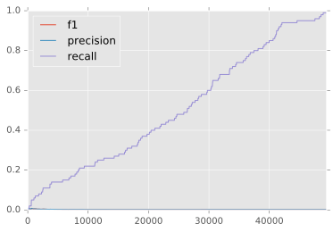

```python
%matplotlib inline

import cPickle as pickle
import matplotlib.pyplot as plt
plt.style.use('ggplot')
%matplotlib inline
%config InlineBackend.figure_format = 'retina'
%config InlineBackend.figure_format = 'svg'

import logging, os, sys

logger = logging.getLogger('root')

program = os.path.basename(sys.argv[0])
logger = logging.getLogger(program)
logging.basicConfig(format='%(asctime)s : %(levelname)s : %(message)s')
logging.root.setLevel(level=logging.INFO)
logger.info("running %s" % ' '.join(sys.argv))

import numpy

import pickle as cPickle

import pandas
```

    INFO:__main__.py:running /Users/linanqiu/.virtualenv/default/lib/python2.7/site-packages/ipykernel/__main__.py -f /Users/linanqiu/Library/Jupyter/runtime/kernel-062bfd6b-cfb0-436f-89d8-77279fd7fd58.json


```python
def plot_metareddit(metareddit):
    reddit_substitute_key = pickle.load(open('substitute_keys/reddit_%s_substitute_key.pkl' % metareddit))
    vocabs_loaded = pickle.load(open('reddit_vocabs_reference/vocabs_reference_reddit_%s.pkl' % metareddit, 'r'))

    reddit_substitute_key_inv = {v: k for k, v in reddit_substitute_key.items()}

    for word, counts in vocabs_loaded.iteritems():
      vocabs_loaded[word]['is_codeword'] = word in reddit_substitute_key_inv

    reddit_counts_codewords = [counts['count'] for word, counts in vocabs_loaded.iteritems() if counts['is_codeword']]
    reddit_counts_usual = [counts['count'] for word, counts in vocabs_loaded.iteritems() if not counts['is_codeword']]

    f, axes = plt.subplots(2, sharex=True)
    f.suptitle('Reddit %s' % metareddit)
    axes[0].set_title('Non-Codewords')
    axes[1].set_title('Codewords')
    axes[0].set_ylabel('Word Count')
    axes[1].set_ylabel('Word Count')
    bins = numpy.linspace(0, 300, 300)
    axes[0].hist(reddit_counts_usual, bins)
    axes[1].hist(reddit_counts_codewords, bins)
    plt.savefig('reddit_figures/reddit_%s.pdf' % metareddit)
    plt.show()

def plot_all():
    reddit_substitute_key = pickle.load(open('substitute_keys/reddit_substitute_key.pkl'))
    vocabs_loaded = pickle.load(open('reddit_vocabs_reference/vocabs_reference_reddit.pkl', 'r'))

    reddit_substitute_key_inv = {v: k for k, v in reddit_substitute_key.items()}

    for word, counts in vocabs_loaded.iteritems():
      vocabs_loaded[word]['is_codeword'] = word in reddit_substitute_key_inv

    reddit_counts_codewords = [counts['count'] for word, counts in vocabs_loaded.iteritems() if counts['is_codeword']]
    reddit_counts_usual = [counts['count'] for word, counts in vocabs_loaded.iteritems() if not counts['is_codeword']]

    f, axes = plt.subplots(2, sharex=True)
    f.suptitle('Reddit')
    axes[0].set_title('Non-Codewords')
    axes[1].set_title('Codewords')
    axes[0].set_ylabel('Word Count')
    axes[1].set_ylabel('Word Count')
    bins = numpy.linspace(0, 300, 300)
    axes[0].hist(reddit_counts_usual, bins)
    axes[1].hist(reddit_counts_codewords, bins)
    plt.savefig('reddit_figures/reddit.pdf')
    plt.show()
```


```python
plot_all()
```


```python
plot_metareddit('entertainment')
```


```python
plot_metareddit('gaming')
```


```python
plot_metareddit('humor')
```


```python
plot_metareddit('learning')
```


```python
plot_metareddit('lifestyle')
```


```python
plot_metareddit('news')
```


```python
plot_metareddit('television')
```


```python
def summary_all():
    reddit_substitute_key = pickle.load(open('substitute_keys/reddit_substitute_key.pkl'))
    vocabs_loaded = pickle.load(open('reddit_vocabs_reference/vocabs_reference_reddit.pkl', 'r'))

    reddit_substitute_key_inv = {v: k for k, v in reddit_substitute_key.items()}

    for word, counts in vocabs_loaded.iteritems():
      vocabs_loaded[word]['is_codeword'] = word in reddit_substitute_key_inv
    
    words = [{'word': word, 'count': vocabs_loaded[word]['count'], 'is_codeword': vocabs_loaded[word]['is_codeword']} for word in vocabs_loaded.iterkeys()]
    
    words = sorted(words, key=lambda k: k['count'])
    
    total_codeword_count = len(reddit_substitute_key)
    
    true_positive = 0 # selected as codeword and is codeword
    true_negative = len(words) - len(reddit_substitute_key) # not selected as codeword and is not codeword
    false_positive = 0 # selected as codeword and isn't codeword
    false_negative = len(reddit_substitute_key) # not selected as codeword and is codeword
    
    precision_recall_f1s = []
    
    for word_count in range(0, len(words)):
        word_tuple = words[word_count]
        if word_tuple['is_codeword']:
            true_positive += 1
            false_negative -= 1
        else:
            false_positive += 1
            true_negative -= 1
        precision = float(true_positive) / float(true_positive + false_positive)
        recall = float(true_positive) / float(true_positive + false_negative)
        try:
            f1 = precision * recall / (precision + recall)
        except ZeroDivisionError:
            f1 = 0
        
        precision_recall_f1s.append({'precision': precision, 'recall': recall, 'f1': f1})
    
    return precision_recall_f1s

def summary_metareddit(metareddit):

    reddit_substitute_key = pickle.load(open('substitute_keys/reddit_%s_substitute_key.pkl' % metareddit))
    vocabs_loaded = pickle.load(open('reddit_vocabs_reference/vocabs_reference_reddit_%s.pkl' % metareddit, 'r'))

    reddit_substitute_key_inv = {v: k for k, v in reddit_substitute_key.items()}

    for word, counts in vocabs_loaded.iteritems():
      vocabs_loaded[word]['is_codeword'] = word in reddit_substitute_key_inv
    
    words = [{'word': word, 'count': vocabs_loaded[word]['count'], 'is_codeword': vocabs_loaded[word]['is_codeword']} for word in vocabs_loaded.iterkeys()]
    
    words = sorted(words, key=lambda k: k['count'])
    
    total_codeword_count = len(reddit_substitute_key)
    
    true_positive = 0 # selected as codeword and is codeword
    true_negative = len(words) - len(reddit_substitute_key) # not selected as codeword and is not codeword
    false_positive = 0 # selected as codeword and isn't codeword
    false_negative = len(reddit_substitute_key) # not selected as codeword and is codeword
    
    precision_recall_f1s = []
    
    for word_count in range(0, len(words)):
        word_tuple = words[word_count]
        if word_tuple['is_codeword']:
            true_positive += 1
            false_negative -= 1
        else:
            false_positive += 1
            true_negative -= 1
        precision = float(true_positive) / float(true_positive + false_positive)
        recall = float(true_positive) / float(true_positive + false_negative)
        try:
            f1 = precision * recall / (precision + recall)
        except ZeroDivisionError:
            f1 = 0
        
        precision_recall_f1s.append({'precision': precision, 'recall': recall, 'f1': f1})
    
    return precision_recall_f1s
```


```python
summary_all = pandas.DataFrame(summary_all())
summary_all.plot()
```


    <matplotlib.axes._subplots.AxesSubplot at 0x109c5fc90>


```python
summary_entertainment = pandas.DataFrame(summary_metareddit('entertainment'))
summary_entertainment.plot()
```


    <matplotlib.axes._subplots.AxesSubplot at 0x10906e390>





```python
summary_gaming = pandas.DataFrame(summary_metareddit('gaming'))
summary_gaming.plot()
```


    <matplotlib.axes._subplots.AxesSubplot at 0x1085ad510>


```python
summary_humor = pandas.DataFrame(summary_metareddit('humor'))
summary_humor.plot()
```


    <matplotlib.axes._subplots.AxesSubplot at 0x10c2f5e10>


```python
summary_learning = pandas.DataFrame(summary_metareddit('learning'))
summary_learning.plot()
```


    <matplotlib.axes._subplots.AxesSubplot at 0x10a5f5f50>


```python
summary_lifestyle = pandas.DataFrame(summary_metareddit('lifestyle'))
summary_lifestyle.plot()
```


    <matplotlib.axes._subplots.AxesSubplot at 0x109d9ced0>


```python
summary_news = pandas.DataFrame(summary_metareddit('news'))
summary_news.plot()
```


    <matplotlib.axes._subplots.AxesSubplot at 0x108940b50>


```python
summary_television = pandas.DataFrame(summary_metareddit('television'))
summary_television.plot()
```


    <matplotlib.axes._subplots.AxesSubplot at 0x108803790>


